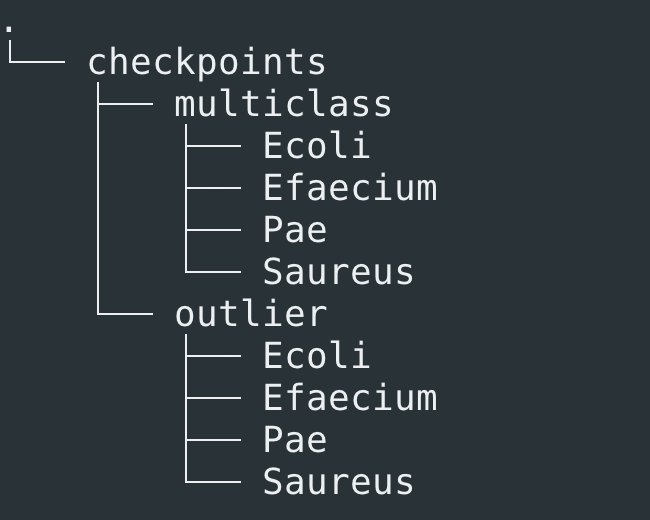

# MALDI-ST - external validation instruction

## Preprocess MALDI-TOF mass spectra
You will need to provide a CSV input file (`input_file_path`) that includes the isolate ID (column `id`) and the corresponding Bruker run path (column `spot_dir`) for each isolate. Please also specify the output directory (`outdir`) where the preprocessed spectra should be saved. An example of the input file can be found [here](./data/maldi_input_file.csv)

```
Rscript preprocess.R -i input_file_path -o outdir
```

## Predict MLST type
We have developed two approaches to predict these MLST types. First, we developed a multiclass classification approach (`src/predict_multiclass.py`) which only predict the common STs. Second, we developed a outlier detection approach which can predict isolates that are not in those common STs (`src/predict_outlier.py`). For the first approach, please only include isolates belongs to the commons STs in the test set. For the second approach, you can include any isolates. Currently, the multiclass model is limited to predicting only a subset of common STs for each species. These include:

> - *Escherichia coli* (8): ST12, ST38, ST69, ST73, ST95, ST127, ST131, ST1193
> - *Pseudomonas aeruginosa* (5): ST111, ST244, ST274, ST649, ST788
> - *Staphylococcus aureus* (7): ST5, ST12, ST15, ST22, ST30, ST45, ST398
> - *Enterococcus faecium* (4): ST78, ST80, ST796, ST1424

You can set these lists as environment variables to parse as arguments for downstream analysis.

```bash
export Ecoli_sts="[12,38,69,73,95,127,131,1193]" && \
export Pae_sts="[111,244,274,649,788]" && \
export Saureus_sts="[5,12,15,22,30,45,398]" && \
export Efaecium_sts="[78,80,796,1424]"
```

### Download model checkpoints
You can download the checkpoints for both the multiclass classifier and the outlier detector from [here](https://www.dropbox.com/scl/fo/d27kkmi3f2yite4b3cyk5/AMuRwT-5HnfE0E5JopscbRs?rlkey=l6i79wef8kypgtmdsi8lgw9xg&st=lg48in9u&dl=0). Please note that the files are approximately 220 GB in size and may take a while to download. The directory structure should appear as follows:

<p align="center">
  
</p>

The subdirectories (e.g., `./checkpoints/multiclass/Ecoli`) hold checkpoints from 10 training runs. To load a model within the Docker container, simply attach the relevant subdirectory when launching the container. More details are provided below.

### Build docker images
First, clone this repository and navigate to the project directory.
```bash
git clone https://github.com/andyvng/maldi_st_ext_validation.git && \
cd maldi_st_ext_validation
```

Now, you can build the Docker images:

```bash
docker build -f Dockerfile.multiclass -t maldist.multiclass:latest .
```

```bash
docker build -f Dockerfile.outlier -t maldist.outlier:latest .
```

### Predict STs
We provide the bash scripts (`predict_multiclass.sh` and `predict_outlier.sh`) to facilitate the process. For both scripts, you need to provide the following arguments.

> - run_id: an integer from 1 to 10
> - The absolute path to the preprocessed spectra directory. This will be mounted to the directory `/preprocessed_MALDI` inside the container.
> - The absolute path to the checkpoints directory. This will be mounted to the directory `/checkpoints` inside the container. Please note that you don't need to specify the run_id subdirectory (e.g., `./checkpoints/multiclass/Ecoli`, not `./checkpoints/multiclass/Ecoli/1`) as the final checkpoint directory will be determined by the `run_id` argument.
> - The absolute path to the file containing the isolate IDs for the test set (an example is available [here](./data/test_ids.csv)). This file will be mounted as /data/test_ids.csv inside the container.
> - The output directory should be specified within the mounted project directory. Since the project folder is mounted to `/maldist` inside the container, any output path under `/maldist` (e.g., `/maldist/out/Ecoli`) will appear in the corresponding location within your project directory on the host.

For `predict_outlier.sh`, you’ll need to provide one additional argument specifying the list of tested STs (for example, the environment variable `Ecoli_sts`).

Here are examples of running the prediction

```bash
for run_id in {1..10} ; do \
    ./predict_multiclass.sh \
    ${run_id} \
    /Path/to/preprocessed/MALDI/directory \
    /Path/to/checkpoints/directory \
    /Path/to/isolate/IDs/of/test/set \
    /Path/to/output/directory; \
done
```

```bash
for run_id in {1..10} ; do \
    ./predict_outlier.sh \
    ${run_id} \
    /Path/to/preprocessed/MALDI/directory \
    /Path/to/checkpoints/directory \
    /Path/to/isolate/IDs/of/test/set \
    /Path/to/output/directory \
    ${Ecoli_sts}; \
done
```
